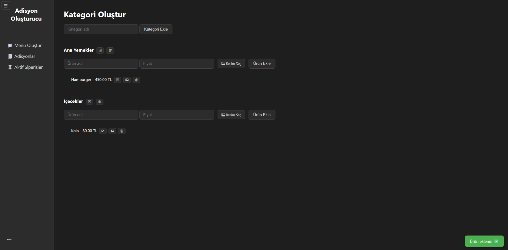
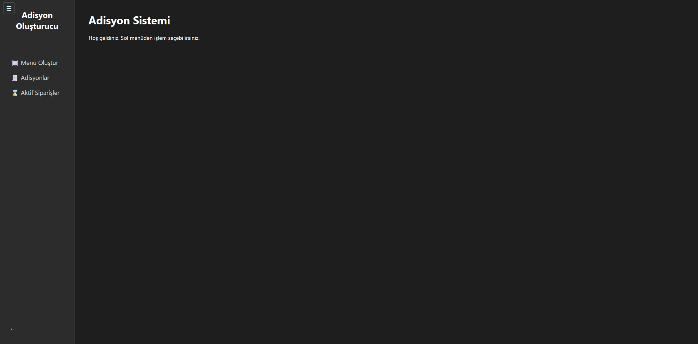
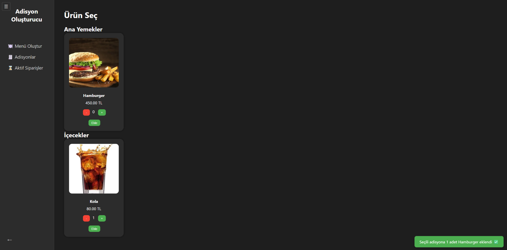
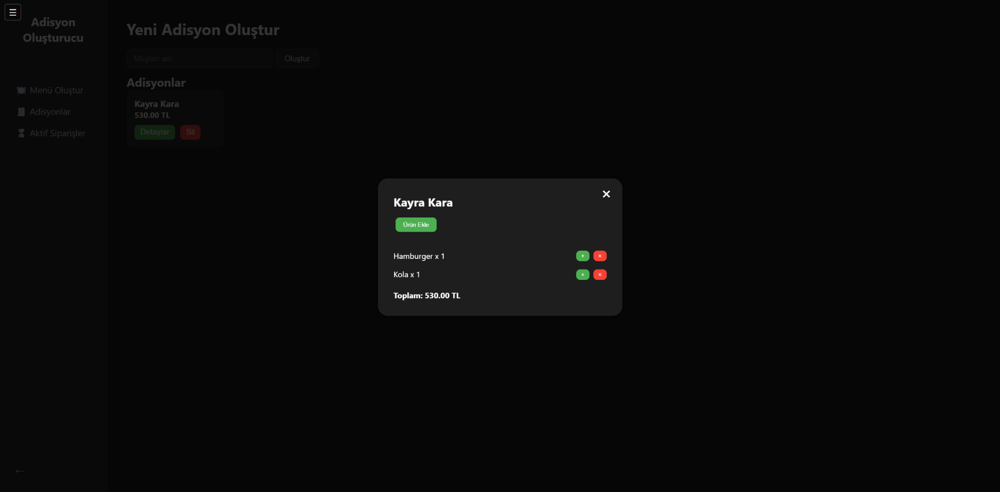
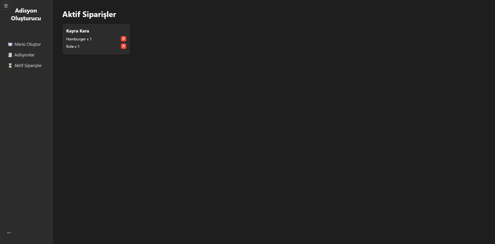

# Adisyon Oluşturucu

Bu proje, küçük restoranlar veya kafeler için basit bir **adisyon takip ve sipariş yönetim sistemidir**. HTML, CSS ve JavaScript kullanılarak geliştirilmiştir. Tarayıcıda çalışır, herhangi bir sunucuya ihtiyaç duymaz.

## 🚀 Özellikler

- Menü oluşturma ve kategorilere ürün ekleme
- Yeni adisyon oluşturma
- Aktif siparişleri görüntüleme
- Ürün miktarı artırma/azaltma
- Adisyonlara ürün ekleyip silme
- Sipariş toplam tutarını gösterme
- Tüm veriler `localStorage` üzerinden saklanır (veri kaybolmaz)

## 🖼️ Görseller

### Menü Oluşturma


### Giriş Sayfası


### Ürün Seçme


### Adisyon Detay


### Aktif Siparişler


## 🛠️ Kullanılan Teknolojiler

- HTML5
- CSS3
- JavaScript (Vanilla JS)
- localStorage API

## 📁 Dosya Yapısı

```
adisyon-olusturucu/
├── index.html
├── menu.html
├── bills.html
├── active-orders.html
├── select-items.html
├── style.css
├── menu.js
├── bills.js
├── active-orders.js
├── historyTracker.js
├── README.md
└── images/
```

## 🧑‍💻 Geliştirici

**Kayra Kara**  
GitHub: [@kayraakara](https://github.com/kayraakara)
